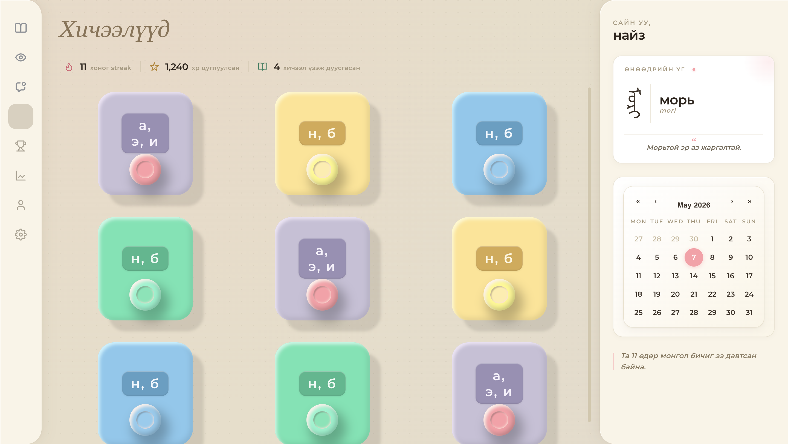

# Mongke — Mongolian Script Learning Platform

> An educational platform built to help learners read, write, and recognize **Mongol bichig** — the traditional vertical Mongolian script. Combines spaced-repetition lessons, freehand drawing recognition, and a custom OCR pipeline trained on synthetic data.

Submitted as a diploma thesis project on the design and development of an innovative multifunctional educational platform for the preservation and revitalization of the Mongolian script.

---

## Screenshots

|                                              |                                                            |
| -------------------------------------------- | ---------------------------------------------------------- |
|  | The landing page — a Mongolian steppe scene with a cursor-revealed traditional vertical-script greeting (*ᠲᠠᠪᠠᠲᠠᠢ ᠮᠣᠷᠢᠯᠠᠨ᠎ᠠ ᠤᠤ* — "welcome"). |
|  | The dashboard — daily streak, XP and lessons stats, the Word of the Day card with vertical *bichig* script and Cyrillic transliteration, an interactive calendar, and the colorful lesson grid. |

---

## Why this exists

Despite a 2030 government policy mandating the return of *Mongol bichig* to official communications, the script is at risk of disappearing in everyday life — younger generations now grow up reading and writing in Cyrillic. Existing learning resources are sparse and rarely interactive. Mongke is an attempt to make practicing the traditional script feel as approachable as Duolingo.

## Features

- **Lesson modules** — multiple-choice character recognition, drag-and-drop letter matching, and freehand drawing recognition.
- **Adaptive spaced repetition** — review intervals (1 / 3 / 7 / 14 / 30 days) that adjust per-character based on accuracy, stored in PostgreSQL.
- **Drawing recognition** — users write characters directly onto a canvas; an image classification model returns the predicted character and grades the answer in real time.
- **Mongolian OCR** — a custom Convolutional Recurrent Neural Network (CRNN) with BiLSTM head trained on synthetic Mongolian text. Users can upload a photo and receive a transcription back.
- **Word of the Day** — a daily Mongol bichig glyph displayed in vertical script, with Cyrillic transliteration and a Mongolian proverb for cultural context.
- **Progress dashboard** — streak tracking, XP, lesson completion, and a calendar view.
- **Community feed** — users post photos of their handwritten practice and comment on each other's work.

## Tech stack

| Layer | Tools |
| --- | --- |
| Frontend | React 18, React Router v6, Axios, react-calendar |
| Styling | Custom CSS (warm cream / coral palette, Mongol bichig vertical script integration) |
| Backend | Node.js, Express, express-session (Postgres-backed), bcrypt |
| Database | PostgreSQL |
| Computer vision | Custom CRNN + BiLSTM (PyTorch) for OCR; Clarifai-trained model for handwritten character recognition |
| Image processing | OpenCV (Python) for OCR preprocessing |

## Architecture

```
┌─────────────────────────┐         ┌──────────────────────────┐
│  React frontend (3000)  │ ◄─────► │  Express API (5001)      │
│  - Lessons / drawing    │         │  - Auth (bcrypt)         │
│  - Dashboard / WOD      │         │  - Spaced-repetition     │
│  - OCR upload UI        │         │  - Posts / comments      │
└────────────┬────────────┘         └──────────┬───────────────┘
             │                                  │
             │                                  ▼
             │                        ┌──────────────────┐
             │                        │   PostgreSQL     │
             │                        │   - Users        │
             │                        │   - Questions    │
             │                        │   - user_progress│
             │                        │   - posts/comments│
             │                        └──────────────────┘
             │
             ▼
     ┌──────────────────────────┐    ┌──────────────────────┐
     │  Clarifai vision API     │    │  Python CRNN (ocr.py)│
     │  (handwriting → char)    │    │  (image → Mongolian) │
     └──────────────────────────┘    └──────────────────────┘
```

## Project structure

```
src/
├── App.js                  # Routes
├── HomePage.js             # Landing page
├── Login.js / registration.js
├── Dashboard.js            # Lesson hub + word-of-day + stats
├── Lesson.js               # Lesson controller (loops through Questions)
├── Question.js             # Multiple-choice
├── DrawingQuestion.js      # Canvas + Clarifai recognition
├── matchingQuestion.js     # Drag-and-drop matching
├── OCR.js                  # Photo → Mongolian text via Python CRNN
├── Social.js               # Community feed + comments
├── server.js               # Express API
├── ocr.py                  # PyTorch CRNN inference
├── create_dataset.py       # Synthetic dataset generator (NotoSansMongolian)
└── *.css
```

## Getting started

### Prerequisites

- Node.js 18+
- PostgreSQL 14+
- Python 3.9+ with PyTorch and OpenCV (for the OCR feature)
- A Clarifai account with a trained handwriting-recognition model (for the drawing feature)

### 1. Clone and install

```bash
git clone https://github.com/<your-username>/mongke.git
cd mongke
npm install
```

### 2. Set up the database

Create a PostgreSQL database, then create the required tables:

```sql
CREATE TABLE public."Users" (
    user_id   SERIAL PRIMARY KEY,
    name      VARCHAR(100) NOT NULL,
    email     VARCHAR(255) UNIQUE NOT NULL,
    password  VARCHAR(255) NOT NULL
);

CREATE TABLE public."Questions" (
    question_id SERIAL PRIMARY KEY,
    lesson_id   INTEGER NOT NULL,
    image       VARCHAR(255),
    answer1     TEXT,
    answer2     TEXT,
    answer3     TEXT,
    def         TEXT NOT NULL
);

CREATE TABLE public.user_progress (
    user_id              INTEGER REFERENCES public."Users"(user_id),
    question_id          INTEGER REFERENCES public."Questions"(question_id),
    last_review_date     TIMESTAMP NOT NULL,
    next_review_interval INTEGER NOT NULL,
    PRIMARY KEY (user_id, question_id)
);

CREATE TABLE public.posts (
    post_id     SERIAL PRIMARY KEY,
    user_id     INTEGER REFERENCES public."Users"(user_id),
    image_path  VARCHAR(255) NOT NULL,
    description TEXT,
    created_at  TIMESTAMP DEFAULT NOW()
);

CREATE TABLE public.comments (
    comment_id SERIAL PRIMARY KEY,
    post_id    INTEGER REFERENCES public.posts(post_id),
    user_id    INTEGER REFERENCES public."Users"(user_id),
    content    TEXT NOT NULL,
    created_at TIMESTAMP DEFAULT NOW()
);

-- Required by connect-pg-simple (session store).
CREATE TABLE "session" (
    "sid"    varchar      NOT NULL COLLATE "default",
    "sess"   json         NOT NULL,
    "expire" timestamp(6) NOT NULL
) WITH (OIDS=FALSE);
ALTER TABLE "session" ADD CONSTRAINT "session_pkey" PRIMARY KEY ("sid") NOT DEFERRABLE INITIALLY IMMEDIATE;
CREATE INDEX "IDX_session_expire" ON "session" ("expire");
```

### 3. Configure environment

```bash
cp .env.example .env
```

Edit `.env` with your Postgres credentials, a randomly generated session secret, and Clarifai keys.

### 4. Run

```bash
npm start
```

This starts the React dev server on `http://localhost:3000` and the Express API on `http://localhost:5001` concurrently.

### 5. (Optional) Run the OCR feature

The OCR endpoint shells out to `src/ocr.py`, which loads a pre-trained PyTorch model (`epoch.pth`). Because the checkpoint is ~67 MB it is not committed to this repo — train your own with `src/create_dataset.py` plus a CRNN training loop, or contact the author for a copy.

```bash
pip install torch torchvision opencv-python pillow numpy matplotlib
```

## Design notes

- The visual identity is built around traditional Mongolian motifs — vertical *bichig* glyphs, a warm cream palette inspired by aged paper, and soft neumorphic lesson cards.
- All UI copy is in Mongolian Cyrillic; the platform is intended for native or heritage learners returning to the traditional script.
- The "Word of the Day" card surfaces a real *bichig* glyph, its Cyrillic equivalent, and a Mongolian proverb — a deliberate choice to ground every learning session in cultural context, not just mechanical drill.

## Roadmap

- Replace the Clarifai-hosted handwriting model with a local PyTorch model so the platform can run fully offline.
- Add audio pronunciation (text-to-speech for Cyrillic, read-aloud recordings for *bichig*).
- Mobile / PWA support for on-the-go practice.
- Augmented-reality camera mode that overlays *bichig* readings on photographed text.

## License

MIT — see `LICENSE`.
